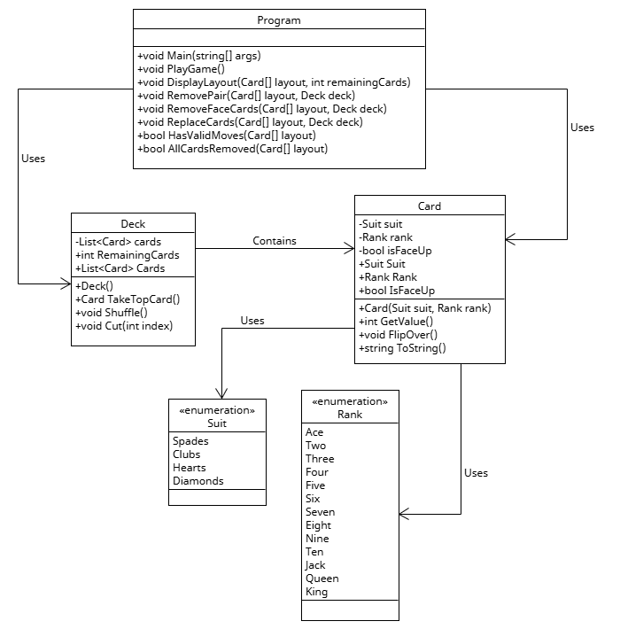

# ElevensGame
## Game Overview:
   Elevens is a card-based logic game where the player is dealt 9 cards (generally). The goal is to find valid combinations that either:

   - Add up to 11 (using two cards), or

   - Include a Jack, Queen, and King (as a set of three).

   The game ends when there are no more valid combinations available, and the deck is empty. The player wins by clearing all cards from both the board and the deck.

## ✅ What is include in this implementation?
   Full class design for: Suit, Rank, Card, Deck, and ElevensGame.

### Core gameplay logic:

- Card shuffling and dealing.
- Move validation.
- Valid selection and move execution.
- Detection of game over and win conditions.
- Full game loop with support for restarting games.
- Remaining deck count display.
- Game-over and win messages.

## 👥 Key Stakeholders:

- End-user: Anyone looking for a fun, casual card game that offers light math and pattern-recognition challenges.

- Developer: Game developers and testers building logic-based card games in Unity.

- Operators: Same as end-users — this game is self-contained and user-operated.

## 🧑‍💻 User Functional Requirements:

- View 8-card game board and current deck count.
- Select cards to form valid combinations.
- Automatically replace cleared cards with new ones from the deck.
- Get feedback for invalid selections.
- Restart the game at any time.
- Win or lose messages displayed appropriately.

## ⚙️ System Functional Requirements:

- Deal 8 random cards at game start.
- Replace removed cards with new ones if deck is not empty.
  
- ### Validate card selections:
      - Two cards summing to 11.
      - Three cards forming J-Q-K set.
      - Detect and handle game over and win conditions.
      - Display error messages for invalid selections.
      - Track and display remaining deck count, and selections.
      - Display winning message when deck is cleared.

## 📐 UML Diagram:

